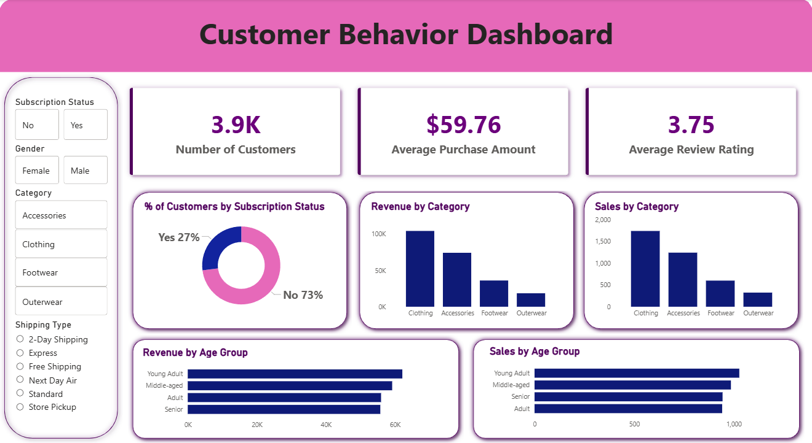

# 🛍️ Customer Shopping Behavior Analysis


---

## 📑 Table of Contents

* Project Overview
* Dataset Summary
* Tech Stack
* Project Workflow
* How to Use
* Business Analysis
* Dashboard
* Key Insights
* Business Recommendations
* Project Structure

---

# 📌 Project Overview

This project analyzes **customer shopping behavior** using a dataset of **3,900 transactions** across multiple product categories. The objective is to identify **spending patterns, customer segments, and product preferences** to generate meaningful business insights.

The project integrates **Python for data processing, PostgreSQL for structured analysis, and Power BI for visualization**.

---

# 📊 Dataset Summary

**Total Records:** 3,900
**Total Features:** 18

### Key Attributes

* **Customer Demographics:** Age, Gender, Location, Subscription Status
* **Purchase Details:** Item Purchased, Category, Purchase Amount, Season, Size, Color
* **Shopping Behavior:** Discount Applied, Previous Purchases, Frequency of Purchases, Review Rating, Shipping Type

---

# ⚙️ Tech Stack

| Tool                   | Purpose                   |
| ---------------------- | ------------------------- |
| Python (Pandas, NumPy) | Data preprocessing        |
| PostgreSQL             | Data storage              |
| SQL                    | Business analysis         |
| Power BI               | Dashboard & visualization |

---

# 🔄 Project Workflow

```
Dataset
   ↓
Data Cleaning & Preparation (Python)
   ↓
Data Storage (PostgreSQL)
   ↓
Business Analysis (SQL Queries)
   ↓
Data Visualization (Power BI)
   ↓
Business Insights
```

---

# 🚀 How to Use

### 1. Clone the Repository

```bash
git clone https://github.com/your-username/customer-shopping-behavior-analysis.git
cd customer-shopping-behavior-analysis
```

### 2. Install Required Libraries

```bash
pip install pandas numpy psycopg2
```

### 3. Run the Python Script

```bash
python data_cleaning_analysis.py
```

### 4. Load Data into PostgreSQL

Import the cleaned dataset into PostgreSQL.

### 5. Execute SQL Queries

Run the queries inside:

```
customer_behaviour.sql
```

### 6. Open Power BI Dashboard

Open the file:

```
customer_behaviour_analysis_fin.pbix
```

to view the visual analytics.

---

# 🧠 Business Analysis

Key questions answered in the analysis:

* Revenue generated by **male vs female customers**
* Identification of **high-spending discount users**
* **Top rated products**
* Purchase comparison between **Standard vs Express shipping**
* Spending patterns of **subscribers vs non-subscribers**
* **Discount-dependent products**
* **Customer segmentation** (New, Returning, Loyal)
* **Top products per category**
* Relationship between **repeat purchases and subscriptions**
* **Revenue contribution by age group**

---

# 📈 Dashboard

An interactive **Power BI dashboard** was built to visualize insights from the dataset.

Add your dashboard screenshot here:


<p align="center">
  
</p>


---

# 🔍 Key Insights

* **Loyal customers** contribute a significant share of total revenue.
* Customers using **Express shipping** tend to spend more.
* Some products show **high dependency on discounts**.
* **Subscriber customers** demonstrate stronger purchase frequency.

---

# 💡 Business Recommendations

* Introduce **customer loyalty programs**
* Encourage **subscription adoption**
* Optimize **discount strategies**
* Focus marketing on **high-value customer segments**

---

# 📁 Project Structure

```
Customer-Shopping-Behavior-Analysis
│
├── data
│   └── customer_shopping _behaviour_.csv
│
├── python
│   └── Customer_Shopping _Behaviour_Analysis.py
│
├── sql
│   └── customer_behaviour.sql
│
├── powerbi
│   └── customer_behaviour_analysis_fin.pbix
│
└── README.md
```

---

# 👨‍💻 Author

**Rodix69**

I'm a Software Engineering Graduate
Interested in **Data Analytics, Machine Learning, and Business Intelligence**.
